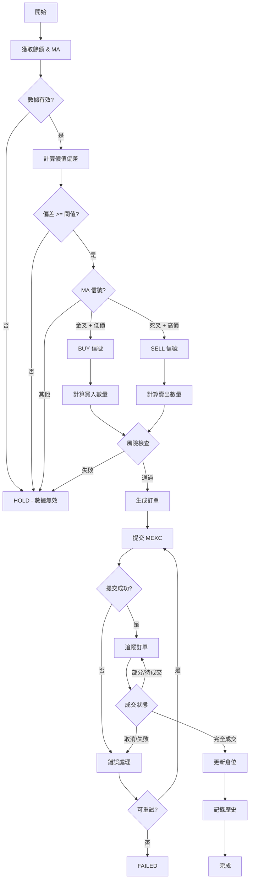

# 智能調倉執行指南：實戰案例與 API 對接

> **文檔目的**: 提供智能調倉策略的實戰執行指南，包含完整的 API 對接流程、錯誤處理、監控指標和故障排除

## 📋 目錄

1. [執行流程總覽](#執行流程總覽)
2. [MEXC API 對接詳解](#mexc-api-對接詳解)
3. [訂單生命週期管理](#訂單生命週期管理)
4. [錯誤處理與重試策略](#錯誤處理與重試策略)
5. [監控與日誌記錄](#監控與日誌記錄)
6. [實戰案例集](#實戰案例集)
7. [故障排除指南](#故障排除指南)

---

## 執行流程總覽

### 完整執行時序圖

```
Time  | Action                        | API Call            | State
------+-------------------------------+---------------------+-------------
00:00 | 觸發調倉任務                  | -                   | START
00:01 | 獲取賬戶餘額                  | GET /account        | ANALYZING
00:02 | 計算 MA 指標                  | GET /klines         | ANALYZING
00:03 | 生成調倉計劃                  | (內部計算)          | PLANNING
00:04 | 檢查風險規則                  | (內部驗證)          | VALIDATING
00:05 | 生成訂單參數                  | (內部計算)          | PREPARING
00:06 | 提交訂單到 MEXC               | POST /order         | EXECUTING
00:07 | 記錄訂單 ID                   | Redis SET           | TRACKING
00:08 | 輪詢訂單狀態 (第 1 次)        | GET /order          | TRACKING
00:10 | 輪詢訂單狀態 (第 2 次)        | GET /order          | TRACKING
00:14 | 輪詢訂單狀態 (第 3 次)        | GET /order          | TRACKING
00:14 | 檢測到完全成交                | -                   | FILLED
00:15 | 更新餘額狀態                  | GET /account        | UPDATING
00:16 | 重新計算平均成本              | (內部計算)          | UPDATING
00:17 | 更新倉位層級                  | (內部計算)          | UPDATING
00:18 | 記錄交易歷史                  | Redis LPUSH         | LOGGING
00:19 | 發送通知                      | (可選)              | COMPLETE
00:20 | 完成                          | -                   | SUCCESS

總耗時: 20 秒
```

### 決策流程圖



---

## MEXC API 對接詳解

### 1. 認證與簽名

#### 簽名生成算法

**步驟 1: 準備查詢字符串**
```python
params = {
    'symbol': 'QRLUSDT',
    'side': 'BUY',
    'type': 'LIMIT',
    'quantity': '1234.56',
    'price': '0.04990',
    'timestamp': '1704096000000',
    'recvWindow': '5000'
}

# 按字母排序參數
sorted_params = sorted(params.items())
# [('price', '0.04990'), ('quantity', '1234.56'), ...]

# 構建查詢字符串
query_string = '&'.join([f"{k}={v}" for k, v in sorted_params])
# "price=0.04990&quantity=1234.56&recvWindow=5000&side=BUY&symbol=QRLUSDT&timestamp=1704096000000&type=LIMIT"
```

**步驟 2: 生成 HMAC-SHA256 簽名**
```python
import hmac
import hashlib

api_secret = "your_api_secret_key"

signature = hmac.new(
    api_secret.encode('utf-8'),
    query_string.encode('utf-8'),
    hashlib.sha256
).hexdigest()

# 範例輸出: "c8db56825ae71d6d79447849e617115f4a920fa2acdcab2b053c4b2838bd6b71"
```

**步驟 3: 添加簽名到請求**
```python
params['signature'] = signature

headers = {
    'X-MEXC-APIKEY': 'your_api_key',
    'Content-Type': 'application/json'
}
```

### 2. 餘額查詢 API

**端點**: `GET /api/v3/account`

**請求範例**:
```python
import time
import httpx

async def get_account_balance():
    timestamp = int(time.time() * 1000)
    params = {
        'timestamp': timestamp,
        'recvWindow': 5000
    }
    
    # 生成簽名
    query_string = f"timestamp={timestamp}&recvWindow=5000"
    signature = generate_signature(query_string, api_secret)
    params['signature'] = signature
    
    # 發送請求
    async with httpx.AsyncClient() as client:
        response = await client.get(
            'https://api.mexc.com/api/v3/account',
            params=params,
            headers={'X-MEXC-APIKEY': api_key}
        )
    
    return response.json()
```

**響應結構**:
```json
{
  "makerCommission": 10,
  "takerCommission": 10,
  "buyerCommission": 0,
  "sellerCommission": 0,
  "canTrade": true,
  "canWithdraw": true,
  "canDeposit": true,
  "updateTime": 1704096000000,
  "accountType": "SPOT",
  "balances": [
    {
      "asset": "QRL",
      "free": "9500.00000000",
      "locked": "500.00000000"
    },
    {
      "asset": "USDT",
      "free": "450.00000000",
      "locked": "50.00000000"
    }
  ]
}
```

**數據提取**:
```python
def extract_balances(account_data):
    balances = {}
    for balance in account_data['balances']:
        asset = balance['asset']
        balances[asset] = {
            'available': float(balance['free']),
            'locked': float(balance['locked']),
            'total': float(balance['free']) + float(balance['locked'])
        }
    return balances

# 結果
{
    'QRL': {
        'available': 9500.0,
        'locked': 500.0,
        'total': 10000.0
    },
    'USDT': {
        'available': 450.0,
        'locked': 50.0,
        'total': 500.0
    }
}
```

### 3. 下單 API

**端點**: `POST /api/v3/order`

**請求範例**:
```python
async def create_limit_order(symbol, side, quantity, price):
    timestamp = int(time.time() * 1000)
    
    params = {
        'symbol': symbol,
        'side': side,  # 'BUY' or 'SELL'
        'type': 'LIMIT',
        'quantity': quantity,
        'price': price,
        'timeInForce': 'GTC',  # Good Till Cancel
        'timestamp': timestamp,
        'recvWindow': 5000
    }
    
    # 生成簽名
    query_string = '&'.join([f"{k}={v}" for k, v in sorted(params.items())])
    signature = generate_signature(query_string, api_secret)
    params['signature'] = signature
    
    # 提交訂單
    async with httpx.AsyncClient() as client:
        response = await client.post(
            'https://api.mexc.com/api/v3/order',
            json=params,
            headers={
                'X-MEXC-APIKEY': api_key,
                'Content-Type': 'application/json'
            }
        )
    
    return response.json()
```

**成功響應**:
```json
{
  "symbol": "QRLUSDT",
  "orderId": "123456789",
  "orderListId": -1,
  "clientOrderId": "rebal_buy_20260101120000",
  "transactTime": 1704096000000,
  "price": "0.04990",
  "origQty": "1234.56",
  "executedQty": "0.00",
  "cummulativeQuoteQty": "0.00",
  "status": "NEW",
  "timeInForce": "GTC",
  "type": "LIMIT",
  "side": "BUY"
}
```

**錯誤響應範例**:
```json
{
  "code": -1013,
  "msg": "Filter failure: MIN_NOTIONAL"
}
```

### 4. 訂單查詢 API

**端點**: `GET /api/v3/order`

**請求範例**:
```python
async def query_order(symbol, order_id):
    timestamp = int(time.time() * 1000)
    
    params = {
        'symbol': symbol,
        'orderId': order_id,
        'timestamp': timestamp
    }
    
    # 生成簽名
    query_string = f"orderId={order_id}&symbol={symbol}&timestamp={timestamp}"
    signature = generate_signature(query_string, api_secret)
    params['signature'] = signature
    
    # 查詢訂單
    async with httpx.AsyncClient() as client:
        response = await client.get(
            'https://api.mexc.com/api/v3/order',
            params=params,
            headers={'X-MEXC-APIKEY': api_key}
        )
    
    return response.json()
```

**響應範例 - 部分成交**:
```json
{
  "symbol": "QRLUSDT",
  "orderId": "123456789",
  "clientOrderId": "rebal_buy_20260101120000",
  "price": "0.04990",
  "origQty": "1234.56",
  "executedQty": "800.00",
  "cummulativeQuoteQty": "39.92",
  "status": "PARTIALLY_FILLED",
  "timeInForce": "GTC",
  "type": "LIMIT",
  "side": "BUY",
  "time": 1704096000000,
  "updateTime": 1704096005000,
  "isWorking": true
}
```

**響應範例 - 完全成交**:
```json
{
  "symbol": "QRLUSDT",
  "orderId": "123456789",
  "clientOrderId": "rebal_buy_20260101120000",
  "price": "0.04990",
  "origQty": "1234.56",
  "executedQty": "1234.56",
  "cummulativeQuoteQty": "61.546",
  "status": "FILLED",
  "timeInForce": "GTC",
  "type": "LIMIT",
  "side": "BUY",
  "time": 1704096000000,
  "updateTime": 1704096015000,
  "isWorking": false
}
```

---

## 訂單生命週期管理

### 狀態機模型

```
NEW (已提交)
  ↓
  ├──→ PARTIALLY_FILLED (部分成交) ──┐
  │         ↓                        │
  │         └──→ (循環等待) ─────────┤
  │                                  ↓
  ├──→ FILLED (完全成交) ────────→ [更新倉位]
  │
  ├──→ CANCELED (已取消) ─────────→ [記錄失敗]
  │
  └──→ EXPIRED (已過期) ──────────→ [記錄失敗]
```

### 訂單追蹤實現

```python
class OrderTracker:
    def __init__(self, order_id, symbol, side, quantity, price):
        self.order_id = order_id
        self.symbol = symbol
        self.side = side
        self.original_quantity = quantity
        self.target_price = price
        
        self.status = 'NEW'
        self.executed_quantity = 0.0
        self.cumulative_quote_qty = 0.0
        self.avg_price = 0.0
        self.fills = []
        
        self.poll_count = 0
        self.start_time = time.time()
        
    async def track_until_complete(self, max_polls=30, timeout_seconds=300):
        """追蹤訂單直到完成或超時"""
        
        while self.poll_count < max_polls:
            # 計算輪詢間隔 (指數退避)
            interval = min(1 * (2 ** self.poll_count), 10)
            await asyncio.sleep(interval)
            
            # 查詢訂單狀態
            order_data = await query_order(self.symbol, self.order_id)
            self._update_from_api(order_data)
            
            self.poll_count += 1
            
            # 檢查終止條件
            if self.status in ['FILLED', 'CANCELED', 'EXPIRED']:
                break
            
            # 超時檢查
            if time.time() - self.start_time > timeout_seconds:
                await self._handle_timeout()
                break
        
        return self._build_result()
    
    def _update_from_api(self, order_data):
        """從 API 響應更新狀態"""
        self.status = order_data['status']
        self.executed_quantity = float(order_data['executedQty'])
        self.cumulative_quote_qty = float(order_data['cummulativeQuoteQty'])
        
        # 計算平均成交價
        if self.executed_quantity > 0:
            self.avg_price = self.cumulative_quote_qty / self.executed_quantity
    
    async def _handle_timeout(self):
        """處理超時情況"""
        if self.status == 'PARTIALLY_FILLED':
            # 取消剩餘訂單
            await cancel_order(self.symbol, self.order_id)
            self.status = 'PARTIALLY_FILLED_TIMEOUT'
        else:
            self.status = 'TIMEOUT'
    
    def _build_result(self):
        """構建結果摘要"""
        return {
            'order_id': self.order_id,
            'status': self.status,
            'original_quantity': self.original_quantity,
            'executed_quantity': self.executed_quantity,
            'remaining_quantity': self.original_quantity - self.executed_quantity,
            'avg_price': self.avg_price,
            'total_cost': self.cumulative_quote_qty,
            'poll_count': self.poll_count,
            'duration': time.time() - self.start_time
        }
```

### 使用範例

```python
# 提交訂單
order_response = await create_limit_order(
    symbol='QRLUSDT',
    side='BUY',
    quantity='1234.56',
    price='0.04990'
)

# 創建追蹤器
tracker = OrderTracker(
    order_id=order_response['orderId'],
    symbol='QRLUSDT',
    side='BUY',
    quantity=1234.56,
    price=0.04990
)

# 追蹤直到完成
result = await tracker.track_until_complete(
    max_polls=30,
    timeout_seconds=300
)

# 處理結果
if result['status'] == 'FILLED':
    # 完全成交 - 更新倉位
    await update_position(result)
elif result['status'] == 'PARTIALLY_FILLED_TIMEOUT':
    # 部分成交超時 - 記錄並處理
    await handle_partial_fill(result)
else:
    # 失敗 - 記錄錯誤
    await log_order_failure(result)
```

---

## 錯誤處理與重試策略

### 常見錯誤碼

| 錯誤碼 | 錯誤消息 | 原因 | 解決方案 |
|--------|----------|------|----------|
| -1013 | MIN_NOTIONAL | 訂單金額低於最小要求 (5 USDT) | 增加訂單數量或跳過交易 |
| -1021 | Timestamp | 時間戳超出允許範圍 | 同步系統時間 |
| -1022 | Invalid signature | 簽名錯誤 | 檢查簽名生成邏輯和密鑰 |
| -2010 | NEW_ORDER_REJECTED | 訂單被拒絕 | 檢查餘額、價格和數量 |
| -2011 | CANCEL_REJECTED | 取消訂單失敗 | 訂單可能已成交或已取消 |
| -1003 | TOO_MANY_REQUESTS | 超過速率限制 | 實現速率限制和退避 |

### 重試策略

```python
class RetryStrategy:
    # 可重試的錯誤碼
    RETRYABLE_ERRORS = {
        -1003,  # 速率限制
        -1021,  # 時間戳問題
        503,    # 服務暫時不可用
        504,    # 網關超時
    }
    
    # 不可重試的錯誤碼
    NON_RETRYABLE_ERRORS = {
        -1013,  # 最小金額不足
        -1022,  # 簽名錯誤
        -2010,  # 訂單被拒絕
    }
    
    @staticmethod
    async def execute_with_retry(func, max_retries=3, base_delay=1):
        """執行帶重試的函數"""
        
        for attempt in range(max_retries):
            try:
                result = await func()
                return result
                
            except MEXCAPIException as e:
                error_code = e.code
                
                # 檢查是否可重試
                if error_code in RetryStrategy.NON_RETRYABLE_ERRORS:
                    raise  # 不可重試，直接拋出
                
                if error_code not in RetryStrategy.RETRYABLE_ERRORS:
                    if attempt == max_retries - 1:
                        raise  # 最後一次嘗試，拋出錯誤
                
                # 計算退避延遲
                delay = base_delay * (2 ** attempt)
                
                # 速率限制特殊處理
                if error_code == -1003:
                    delay = max(delay, 5)  # 至少等待 5 秒
                
                await asyncio.sleep(delay)
                
            except Exception as e:
                # 網路錯誤等
                if attempt == max_retries - 1:
                    raise
                await asyncio.sleep(base_delay * (2 ** attempt))
        
        raise Exception(f"Failed after {max_retries} attempts")
```

### 錯誤處理範例

```python
async def place_order_with_handling(order_params):
    """下單並處理各種錯誤"""
    
    try:
        # 嘗試提交訂單 (帶重試)
        order_response = await RetryStrategy.execute_with_retry(
            lambda: create_limit_order(**order_params)
        )
        
        return {'success': True, 'order': order_response}
        
    except MEXCAPIException as e:
        if e.code == -1013:
            # 最小金額不足
            return {
                'success': False,
                'error': 'MIN_NOTIONAL',
                'message': f"Order notional ({order_params['quantity'] * order_params['price']}) below minimum (5 USDT)",
                'action': 'SKIP_TRADE'
            }
        
        elif e.code == -2010:
            # 訂單被拒絕 - 檢查原因
            reason = await diagnose_rejection(order_params)
            return {
                'success': False,
                'error': 'ORDER_REJECTED',
                'message': str(e),
                'reason': reason,
                'action': 'CHECK_BALANCE'
            }
        
        else:
            # 其他錯誤
            return {
                'success': False,
                'error': 'API_ERROR',
                'code': e.code,
                'message': str(e),
                'action': 'LOG_AND_ALERT'
            }
    
    except Exception as e:
        # 未預期的錯誤
        return {
            'success': False,
            'error': 'UNKNOWN_ERROR',
            'message': str(e),
            'action': 'LOG_AND_ALERT'
        }
```

---

## 監控與日誌記錄

### 關鍵指標

```python
# Prometheus 風格的指標定義
METRICS = {
    'rebalance_execution_total': Counter(
        'Number of rebalance executions',
        ['status', 'action']
    ),
    'rebalance_execution_duration_seconds': Histogram(
        'Duration of rebalance execution',
        ['action']
    ),
    'order_fill_rate': Gauge(
        'Order fill rate percentage',
        ['side']
    ),
    'position_value_usdt': Gauge(
        'Current position value in USDT',
        ['asset']
    ),
    'average_cost_usdt': Gauge(
        'Average cost per QRL',
        []
    ),
    'api_errors_total': Counter(
        'Number of API errors',
        ['error_code', 'endpoint']
    ),
}
```

### 結構化日誌

```python
import json
import logging
from datetime import datetime

class RebalanceLogger:
    def __init__(self, logger_name='rebalance'):
        self.logger = logging.getLogger(logger_name)
        
    def log_execution_start(self, plan):
        """記錄執行開始"""
        self.logger.info(json.dumps({
            'timestamp': datetime.utcnow().isoformat(),
            'event': 'rebalance_start',
            'plan': {
                'action': plan['action'],
                'quantity': plan.get('quantity'),
                'notional': plan.get('notional_usdt'),
                'reason': plan['reason']
            }
        }))
    
    def log_order_submitted(self, order_response):
        """記錄訂單提交"""
        self.logger.info(json.dumps({
            'timestamp': datetime.utcnow().isoformat(),
            'event': 'order_submitted',
            'order': {
                'order_id': order_response['orderId'],
                'symbol': order_response['symbol'],
                'side': order_response['side'],
                'type': order_response['type'],
                'quantity': order_response['origQty'],
                'price': order_response['price']
            }
        }))
    
    def log_order_filled(self, order_result):
        """記錄訂單成交"""
        self.logger.info(json.dumps({
            'timestamp': datetime.utcnow().isoformat(),
            'event': 'order_filled',
            'order': {
                'order_id': order_result['order_id'],
                'status': order_result['status'],
                'executed_quantity': order_result['executed_quantity'],
                'avg_price': order_result['avg_price'],
                'total_cost': order_result['total_cost'],
                'duration': order_result['duration']
            }
        }))
    
    def log_position_updated(self, before, after):
        """記錄倉位更新"""
        self.logger.info(json.dumps({
            'timestamp': datetime.utcnow().isoformat(),
            'event': 'position_updated',
            'before': before,
            'after': after,
            'changes': {
                'qrl_change': after['qrl'] - before['qrl'],
                'usdt_change': after['usdt'] - before['usdt'],
                'cost_change': after['cost_avg'] - before['cost_avg']
            }
        }))
    
    def log_error(self, error_type, error_details):
        """記錄錯誤"""
        self.logger.error(json.dumps({
            'timestamp': datetime.utcnow().isoformat(),
            'event': 'rebalance_error',
            'error_type': error_type,
            'details': error_details
        }))
```

### 監控看板範例

```yaml
# Grafana Dashboard 配置
dashboard:
  title: "QRL Rebalance Monitoring"
  panels:
    - title: "Rebalance Actions (24h)"
      query: "sum by(action) (increase(rebalance_execution_total[24h]))"
      type: "pie"
    
    - title: "Execution Duration"
      query: "histogram_quantile(0.95, rebalance_execution_duration_seconds)"
      type: "graph"
    
    - title: "Position Value"
      queries:
        - "position_value_usdt{asset='QRL'}"
        - "position_value_usdt{asset='USDT'}"
      type: "graph"
    
    - title: "Average Cost Trend"
      query: "average_cost_usdt"
      type: "graph"
    
    - title: "API Error Rate"
      query: "rate(api_errors_total[5m])"
      type: "graph"
    
    - title: "Order Fill Rate"
      query: "order_fill_rate"
      type: "gauge"
```

---

## 實戰案例集

### 案例 1: 正常買入執行

**場景**: QRL 價值低於目標，需要買入

**初始狀態**:
```json
{
  "qrl": 8000,
  "usdt": 600,
  "price": 0.05000,
  "cost_avg": 0.05200
}
```

**執行日誌**:
```
[12:00:00] 開始調倉分析
[12:00:01] 獲取餘額: QRL=8000, USDT=600
[12:00:02] 計算 MA: MA_7=0.04950, MA_25=0.04920
[12:00:03] 生成計劃: BUY 2000 QRL @ 0.04990
[12:00:04] 風險檢查: 通過 (notional=99.8 USDT, deviation=10%)
[12:00:05] 提交訂單: order_id=123456789
[12:00:06] 記錄訂單到 Redis
[12:00:08] 輪詢狀態 #1: NEW, executed=0
[12:00:10] 輪詢狀態 #2: PARTIALLY_FILLED, executed=800
[12:00:14] 輪詢狀態 #3: FILLED, executed=2000
[12:00:15] 更新餘額: QRL=10000, USDT=500.14
[12:00:16] 更新成本: 0.05200 → 0.05158 (-0.81%)
[12:00:17] 更新倉位層級
[12:00:18] 記錄交易歷史
[12:00:19] 完成 (總耗時: 19秒)
```

### 案例 2: 部分成交處理

**場景**: 限價單只部分成交，需要決策處理

**執行日誌**:
```
[14:00:00] 提交訂單: SELL 3600 QRL @ 0.05010
[14:00:01] order_id=987654321
[14:00:03] 輪詢 #1: PARTIALLY_FILLED, executed=1500
[14:00:07] 輪詢 #2: PARTIALLY_FILLED, executed=2200
[14:00:15] 輪詢 #3: PARTIALLY_FILLED, executed=2800
[14:00:31] 輪詢 #4: PARTIALLY_FILLED, executed=2950
[14:00:51] 超時檢測: 已等待 50 秒，成交率=81.9%
[14:00:52] 決策: 接受部分成交，取消剩餘訂單
[14:00:53] 取消訂單: order_id=987654321
[14:00:54] 最終成交: 2950 QRL @ avg 0.05012
[14:00:55] 更新倉位 (按實際成交數量)
```

### 案例 3: 錯誤恢復

**場景**: 首次提交失敗，重試成功

**執行日誌**:
```
[16:00:00] 提交訂單: BUY 1500 QRL @ 0.04980
[16:00:01] 錯誤: -1003 TOO_MANY_REQUESTS
[16:00:02] 重試策略: 等待 1 秒後重試 (1/3)
[16:00:03] 重試提交...
[16:00:04] 錯誤: -1003 TOO_MANY_REQUESTS
[16:00:05] 重試策略: 等待 2 秒後重試 (2/3)
[16:00:07] 重試提交...
[16:00:08] 成功: order_id=111222333
[16:00:09] 繼續追蹤訂單...
```

### 案例 4: 不可恢復錯誤

**場景**: 訂單金額低於最小要求

**執行日誌**:
```
[18:00:00] 生成計劃: BUY 80 QRL @ 0.05000
[18:00:01] 計算金額: 80 × 0.05000 = 4.00 USDT
[18:00:02] 提交訂單...
[18:00:03] 錯誤: -1013 MIN_NOTIONAL
[18:00:04] 分析: 訂單金額 4.00 USDT < 最小要求 5.00 USDT
[18:00:05] 決策: 跳過此次交易
[18:00:06] 記錄: HOLD (notional below minimum)
[18:00:07] 完成 (無交易執行)
```

---

## 故障排除指南

### 問題 1: 訂單一直處於 NEW 狀態

**症狀**:
- 訂單提交成功
- 長時間停留在 NEW 狀態
- 沒有任何成交

**可能原因**:
1. 限價設置過於激進，市場價格無法觸及
2. 市場流動性不足
3. 訂單本被其他大單佔據

**排查步驟**:
```python
# 1. 檢查當前市場價格
current_price = await get_ticker_price('QRLUSDT')
order_price = 0.04990

# 2. 比較價格差距
if order_price < current_price * 0.995:  # 買入價低於市場價 0.5%
    print("買入價過低，市場價格無法觸及")
    
# 3. 檢查訂單簿深度
orderbook = await get_orderbook('QRLUSDT', limit=20)
best_bid = orderbook['bids'][0][0]
best_ask = orderbook['asks'][0][0]

print(f"最佳買價: {best_bid}, 你的限價: {order_price}")
print(f"價格差距: {(float(best_bid) - order_price) / order_price * 100:.2f}%")
```

**解決方案**:
```python
# 方案 1: 取消並重新以市價單提交
await cancel_order(symbol, order_id)
await create_market_order(symbol, side, quantity)

# 方案 2: 調整限價更接近市場價
new_price = current_price * 0.999  # 買入價設為市場價的 99.9%
await cancel_order(symbol, order_id)
await create_limit_order(symbol, side, quantity, new_price)
```

### 問題 2: 簽名驗證失敗

**症狀**:
- 錯誤碼: -1022
- 錯誤消息: "Invalid signature"

**排查步驟**:
```python
# 1. 檢查參數排序
params = {'symbol': 'QRLUSDT', 'side': 'BUY', 'timestamp': 1704096000000}
sorted_params = sorted(params.items())
print("排序後參數:", sorted_params)

# 2. 檢查查詢字符串
query_string = '&'.join([f"{k}={v}" for k, v in sorted_params])
print("查詢字符串:", query_string)

# 3. 檢查簽名
import hmac
import hashlib

signature = hmac.new(
    api_secret.encode('utf-8'),
    query_string.encode('utf-8'),
    hashlib.sha256
).hexdigest()
print("生成簽名:", signature)

# 4. 驗證 API 密鑰
print("API Key 長度:", len(api_key))
print("API Secret 長度:", len(api_secret))
```

**常見錯誤**:
1. 參數未按字母順序排序
2. 查詢字符串格式錯誤 (多餘空格、特殊字符)
3. API Secret 有多餘的空格或換行符
4. 使用了錯誤的 API Key/Secret

**解決方案**:
```python
# 確保密鑰清理
api_key = api_key.strip()
api_secret = api_secret.strip()

# 標準化簽名生成
def generate_signature(params, secret):
    # 移除 signature 參數本身
    params = {k: v for k, v in params.items() if k != 'signature'}
    
    # 字母排序
    sorted_params = sorted(params.items())
    
    # 構建查詢字符串
    query_string = '&'.join([f"{k}={v}" for k, v in sorted_params])
    
    # 生成簽名
    signature = hmac.new(
        secret.encode('utf-8'),
        query_string.encode('utf-8'),
        hashlib.sha256
    ).hexdigest()
    
    return signature
```

### 問題 3: 餘額不足錯誤

**症狀**:
- 錯誤碼: -2010
- 錯誤消息: "Account has insufficient balance"

**排查步驟**:
```python
# 1. 獲取實際餘額
account = await get_account_balance()
qrl_available = account['QRL']['available']
usdt_available = account['USDT']['available']

# 2. 計算訂單所需
if side == 'BUY':
    required = quantity * price * 1.001  # 包含手續費
    available = usdt_available
    print(f"需要 USDT: {required}, 可用: {available}")
else:  # SELL
    required = quantity
    available = qrl_available
    print(f"需要 QRL: {required}, 可用: {available}")

# 3. 檢查鎖定餘額
print(f"鎖定 QRL: {account['QRL']['locked']}")
print(f"鎖定 USDT: {account['USDT']['locked']}")
```

**解決方案**:
```python
# 方案 1: 取消現有掛單釋放餘額
open_orders = await get_open_orders('QRLUSDT')
for order in open_orders:
    await cancel_order('QRLUSDT', order['orderId'])
    print(f"取消訂單 {order['orderId']} 釋放餘額")

# 方案 2: 調整訂單數量
if required > available:
    adjusted_quantity = available / (price * 1.001)  # 留出手續費空間
    print(f"調整數量: {quantity} → {adjusted_quantity}")
```

---

## 總結

### 執行清單

**提交前檢查**:
- [ ] 餘額充足
- [ ] 價格合理 (接近市場價)
- [ ] 數量符合精度要求
- [ ] 金額滿足最小要求 (≥5 USDT)
- [ ] 簽名正確
- [ ] 時間戳有效

**執行中監控**:
- [ ] 訂單狀態正常更新
- [ ] 成交進度合理
- [ ] 無異常錯誤
- [ ] 執行時間在預期範圍

**完成後驗證**:
- [ ] 訂單完全成交或合理部分成交
- [ ] 餘額更新正確
- [ ] 平均成本計算準確
- [ ] 倉位層級重新分配
- [ ] 交易記錄已保存

### 性能指標

**正常執行**:
- 總耗時: 15-30 秒
- API 調用: 4-6 次
- 訂單成交: 100% 或 ≥80%

**異常情況**:
- 超時: >60 秒
- 重試: >3 次
- 成交率: <50%

---

**文檔版本**: 1.0  
**最後更新**: 2026-01-01  
**維護者**: QRL Trading System Team
